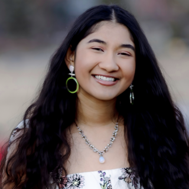
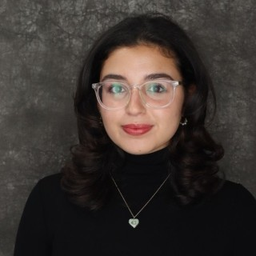

------

## People
In alphabetical order by last name.
| Headshot | Biography |
|:--------:|-----|
|  | **Olivia Ackerson, Environmental Science, RA** Olivia Ackerson is a junior at Rutgers University, majoring in Environmental Science with a minor in Environmental Policy, Institutions, and Behavior. She is passionate about addressing climate change, advancing environmental policy, and furthering science communication. Olivia is working as a research assistant under Dr. Roy, involved in research on policies to mitigate lead in drinking water in low- and middle-income countries. She is also assisting with research on lead in Chicago’s water supply and consumer trust/public perceptions surrounding this issue. |
|  | **Aanand Aggarwal, Computer Science and Information Technology & Informatics, Aresty RA** My name is Aanand Aggarwal and I am a senior in the SAS Honors Program. I am pursuing a dual degree in Computer Science and Information Technology & Informatics, and I am in my first semester of the 5-Year BA/MI Program in Data Science. A fun fact about me is that I have two rescue dogs that are siblings, and I have two birds that are also siblings. My research interests include machine learning, artificial intelligence, and big data analytics; I'm eager to work under Dr. Roy to explore their applications within aquatic chemistry and public health.  |
|  | **Bobo Au-Yeung, Psychology and Criminal Justice, Aresty RA** My name is Bobo Au-Yeung and I am a Psychology and Criminal Justice double major with a minor in Health Administration. My professional and research interests lie in mental and physical preventative health, in hopes of addressing the shortage of medical services available. I spend my free time working on 2D animation projects. My current research aims to identify and formulate an intervention process to alleviate the psychological effects of negative messaging (nocebo), particularly in children post-environmental crises. |
|  | **Ishani Bhaumik, Chemistry, Aresty RA** My name is Ishani Bhaumik and I am a second-year Chemistry major with interest in environmental issues pertaining to chemistry. I have previous experience writing about what possible chemical processes aid in reducing carbon dioxide in the atmosphere. This year, I am working with Dr. Roy to investigate trends of lead release from pipes into potable water in New Jersey.  |
|  | **Charlene Guo, Environmental Science, Aresty RA** Charlene Guo is a second-year student at Rutgers University majoring in environmental science. She has been captivated by science from a young age and aspires to use it to serve and improve our society and planet. This year, she will analyze wastewater and biomonitoring data to investigate lead release into tap water, following up on the Flint Water Crisis. |
|  | **Daniella Mangibin, Computer Science, Aresty RA** Hello, I am Daniella Mangibin, and I am a third-year student at Rutgers University studying Computer Science and Data Science. I am interested in applying my technical skills to make advancements and address key challenges in the life sciences, particularly in areas such as the environment and health. My Aresty project is to build a deep learning model that will recognize types of corrosion on potable water pipes and plumbing. I look forward to the project's results and impact! |
|  | **Leyla Muñoz, Public Health, Aresty RA** HI! My name is Leyla Munoz, and I am a Public Health major at Rutgers University. I am very interested in epidemiologic and policy-related research. For this project, I will focus on wastewater and blood lead surveillance and give an update on the Flint Water Crisis. |

#### Alumni
**Undergraduate Researchers**
- Eva Rehman, Biotechnology, Spring 2024
- Bhuvan Bugude, Biology/Pre-Med, Spring 2024

-----

### Awards to student advisees
**National level**
- First Prize – Technical Poster (Tolu Odimayomi – AWWA Annual Conference and Exposition 2021), 2021
- First Prize – Technical Poster - People’s Choice (Tolu Odimayomi – AWWA Annual Conference and Exposition 2021), 2021

**State level**
- First Prize – Technical Paper (Philip Smith – ASCE Virginias’ Section), 2018
- Third Prize – Technical Paper (Kristine Mapili – ASCE Virginias’ Section), 2016

**University level**
- Third Prize – Technical Poster (Philip Smith – 7th CEE Research Day, Virginia Tech), 2017
- First Prize – Technical Poster (Kristine Mapili – 6th CEE Research Day, Virginia Tech), 2016
- First Prize – Technical Poster (Zihan Wang – 5th CEE Research Day, Virginia Tech), 2015

-----

## Advising before Rutgers

#### UNC Chapel Hill
- Kyle Rezek, MSPH graduate committee member and advisor on lead leaching experiments using NSF-61 test water and blood lead modeling projects (graduated 2024)

#### Virginia Tech (lead advisor Dr. Marc Edwards)
**Undergraduate Students**
- Minyoung Choi, Lead in drinking water and public trust in Chicago survey (manuscript underway), 2020-21
- Fadi Hindi, Lead in drinking water and public trust in Chicago (manuscript underway), 2020-21
- Gregory House, Erosion Corrosion in Copper and Nonleaded Alloys used in potable water systems (co-author on peer-reviewed article in CORROSION), 2015-17
- Natalie Kinnamon, Reimagining of water quality consumer confidence reports from US water utilities, 2020-21
- Grace Psenicska,	Sourcing NSF graduate research fellows' public contact information for a national perceptions survey about incentives, research misconduct, and scientific integrity in STEM academia, 2019
- Sophia Lee, Misinformation around Flint Water during the Federal Emergency and water sampling for opportunistic pathogens in Flint, 2016-17
- Helen Salko,	Analyzing blood lead level trends in the United States using NHANES data, 2019-20
- Philip Smith, Erosion Corrosion and Cavitation in Copper and Nonleaded Alloys used in potable water systems (co-author on peer-reviewed article in CORROSION), 2015-17
- Brenda Velasco, Competition for engineering tenure-track faculty positions in the United States (co-author on peer-reviewed article in PNAS Nexus), 2020-21
- Zihan Wang, Erosion Corrosion in Copper and Nonleaded Alloys used in potable water systems, 2014-15
- Carol Yang,	Whistleblowing and the Tuskegee Syphilis Experiment (co-author on popular science article in American Scientist), 2019-20

**Graduate Students**
- Chivonne Battle, Environmental Justice, waterborne lead, and trust in drinking water in Chicago Metropolitan Area (manuscript underway), 2018-20
- Kris Mapili (last known:	Civil Engineer, Wood),	Erosion corrosion of copper in the presence of common disinfectants: free chlorine, chloramine, chlorine dioxide, 2015-16
- Frank Mazzola (last known: PhD candidate, Virginia Tech), (co-first author on peer-reviewed article under review), 2021-23
- Dr. Kathryn Lopez (last known: ORISE Postdoc, US EPA) Blood lead modeling in three US cities and water sampling in the Chicago metropolitan area (co-author on peer-reviewed article in ACS ES&T Water), 2018-19
- Dr. Taylor Lightner (last known: Research Associate, Quality Education for Minorities Network), Narrative Analysis of Engineering Graduate Students’ Journeys Navigating Public-Inspired Science Work (co-author on peer-reviewed conference article in ASEE Annual Conference 2021), 2020-21
- Tolulope Odimayomi (last known: Ph.D. candidate, Virginia Tech),	Biosolids monitoring as an independent method for tracking population-level water lead exposure (AWWA ACE national conference poster awardee; manuscript underway) and citizen science sampling for opportunistic pathogens (co-author on peer-reviewed article in ACS ES&T Water), 2020-22

Last updated: September 2024
